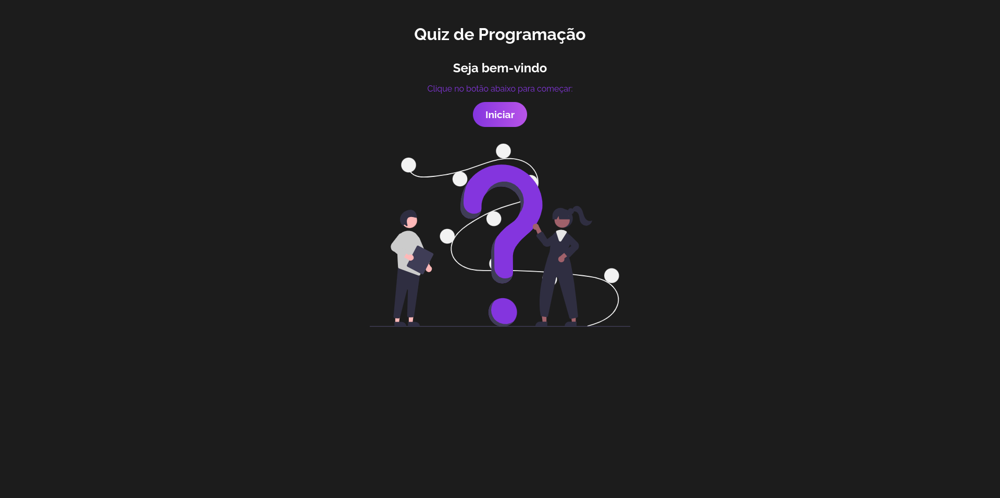
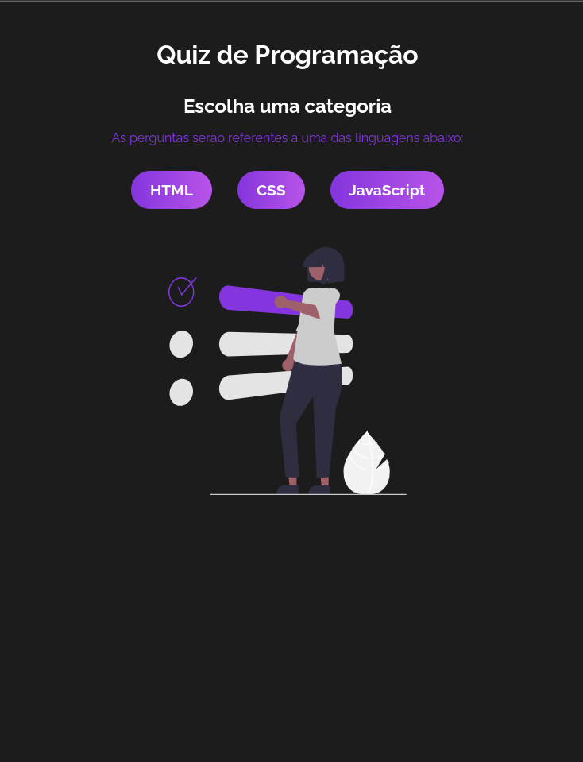
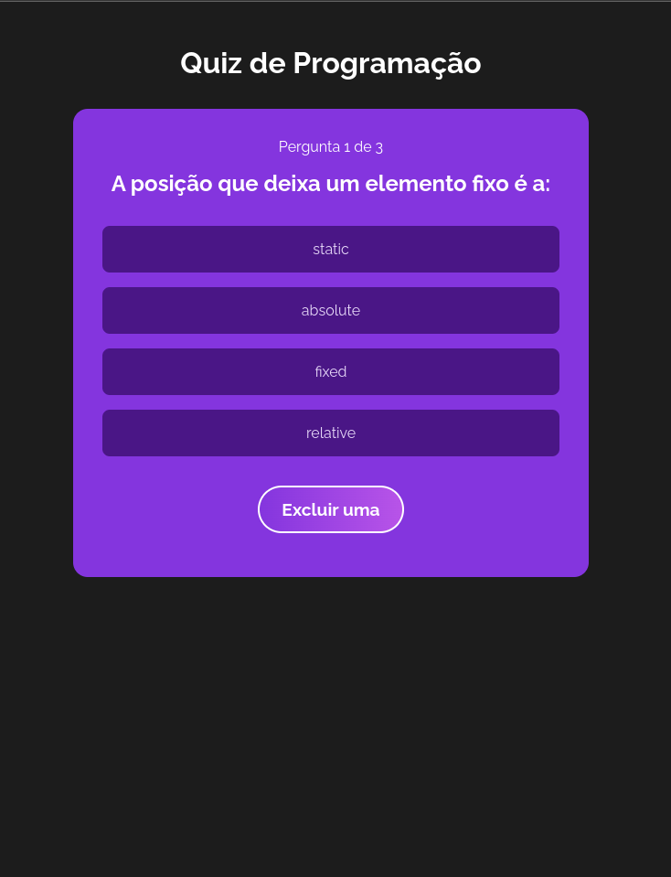
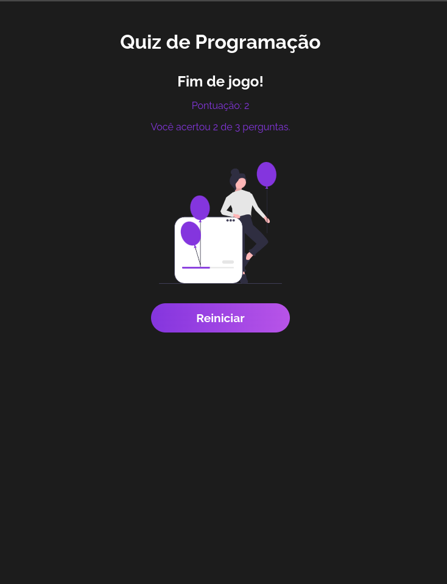

# Quiz

## Quiz feito com ReactJs. Ao iniciar o jogo, você deverá escolher o tema das perguntas. Após essa escolha, o quiz se inicia e você terá a opção de uma ajuda durante as perguntas. Concluíndo todas a respostas, o placar final de respostas corretas é mostrado e existe a opção de reiniciar.

    
    
    
    

  Feito com ♡ por Helen Andrade

